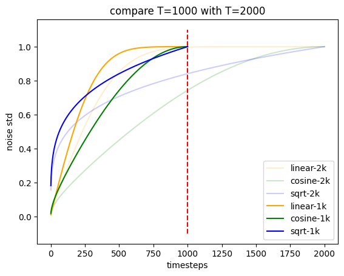

# noise-schedule
## noise-schedule compare expriment.
- linear from [DDPM](https://arxiv.org/abs/2006.11239)
- cosine from [iDDPM](https://arxiv.org/abs/2102.09672)
- sqrt from [Diffusion-LM](https://arxiv.org/abs/2205.14217)

reproducing this small expriment in Appendix A in [Li's Diffusion-LM](https://arxiv.org/pdf/2205.14217.pdf)
   
## Add T=1000 and T=2000 noise's std   

