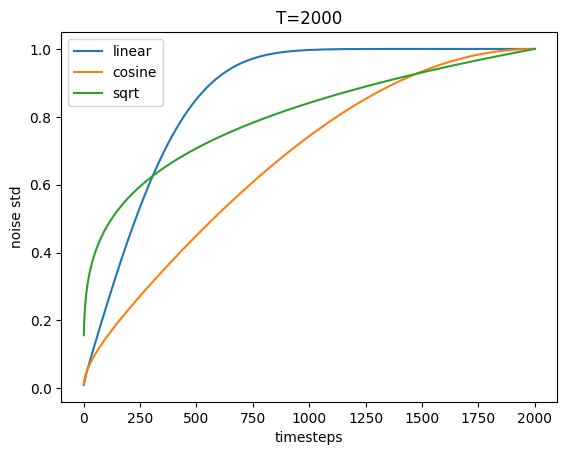

# noise-schedule
noise-schedule compare expriment.
- linear from DDPM
- cosine from iDDPM
- sqrt from Diffusion-LM

reproducing this small expriment in Appendix A in [Li's Diffusion-LM](https://arxiv.org/pdf/2205.14217.pdf)
